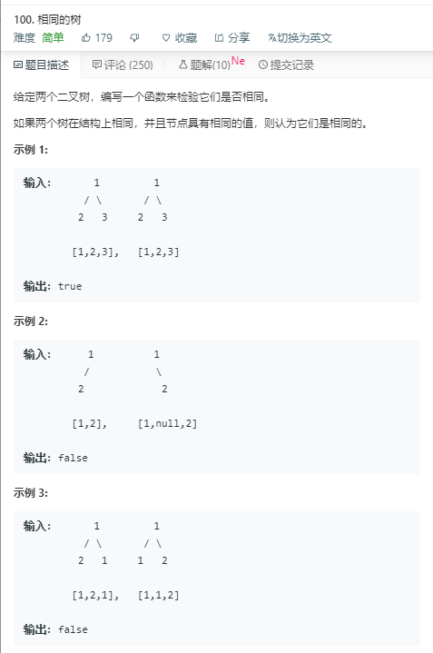

# 相同的树（简单） 


代码如下：
```
var isSameTree = function(p, q) {
    if(p==null||q==null){
        return p == null && q == null;
    }
    return p.val===q.val && isSameTree(p.left,q.left) && isSameTree(p.right,q.right)
};
```
运行结果：


完成日期：2019/05/27