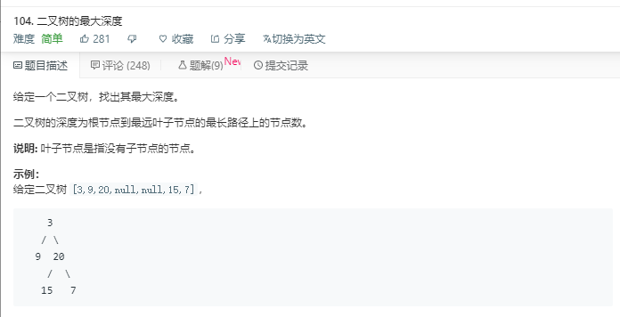

# 二叉树的最大深度



代码如下：

``` javascript
var maxDepth = function(root) {
    if(root==null){
        return 0;
    }else{
        return Math.max(maxDepth(root.left),maxDepth(root.right))+1
    }
};
```

运行结果：


完成日期：2019/05/29
