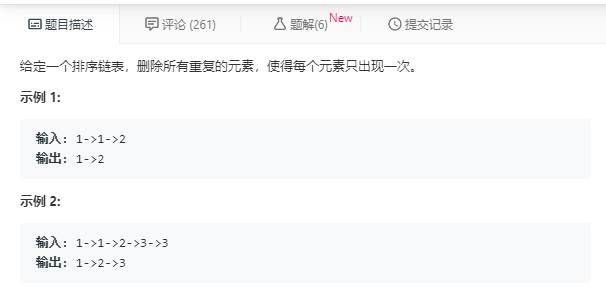
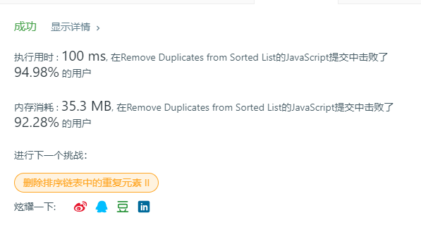

# 删除排序链表中的重复元素（简单）



代码如下：

``` javascript
var deleteDuplicates = function (head) {
    var current=head;
    while(current!==null&&current.next!==null){
        if(current.val==current.next.val){
            current.next=current.next.next
        }else{
            current=current.next
        }
    }
    return head
};
```

运行结果：



完成日期：2019/05/23
