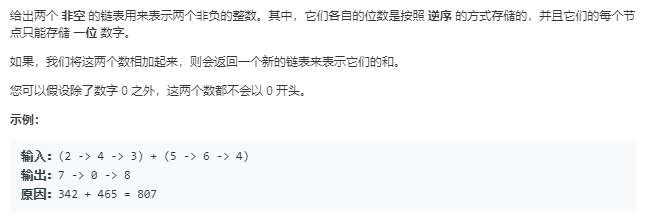
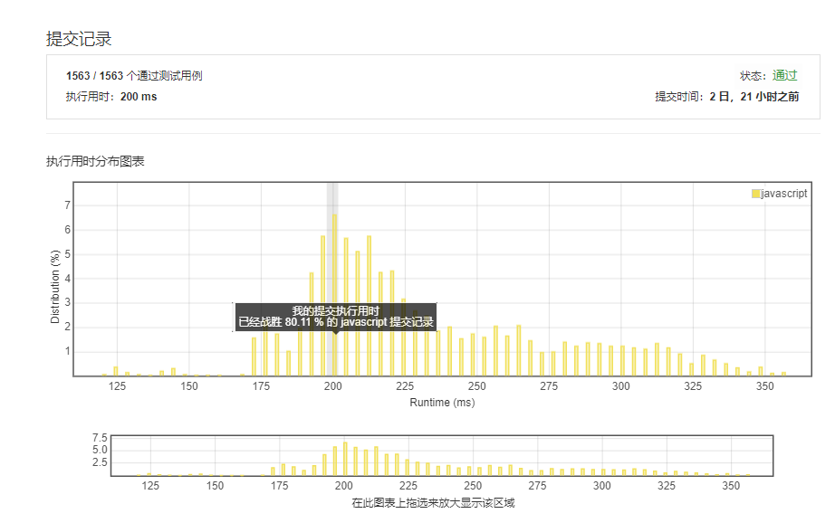

# 两数相加（简单）



由于我用的是JavaScript，所以链表得自己定义，由于起初的审题失误，导致第一次做题直接用了数组存储整数，结果如下：

``` javascript
function getNumber(arr){
    var result=0,
        a=1;
    for(var i=0;i<arr.length;i++){
        result+=arr[i]*a;
        a=a*10;
    }
    return result;
}
function getArray(number){
    var result=[];
    var str = number.toString();
    for(var i=0;i<str.length;i++){
        result.push(parseInt(str[i]));
    }
    return result.reverse();
}
var addTwoNumbers = function(l1, l2) {
    var n1=getNumber(l1),
        n2=getNumber(l2);
    var result_number = n1 + n2;
    return getArray(result_number);
};
```

（上面的代码为电脑重复敲，但为了更好的理解浏览器如何解释代码，我选择了以后做题手写代码）
核心思想是把数组还原成数字，再相加得出结果，结果转换为数组再用reverse方法倒序输出结果，满足题意。
但不满足题目中一个关键要素————用链表存储整数，于是功亏一篑，重做如下：

``` javascript
var addTwoNumbers=function(l1,l2){
    var up=0;
    var total;
    var a=new ListNode(null);
    var result=new ListNode(null);
    var pushIt=function(val,List){
        if(List.val===null){
            List.val=val;
        }else{
            while(List.next!==null){
                List=List.next
            };
            List.next=new ListNode(val);
        }
    };
    var val1=l1,
        val2=l2;
    while(val1!==null&&val2!==null){
        total=val1.val+val2.val+up;
        if(total>=10){
            up=1;
            total-=10;
            pushIt(total,result);
        }else{;
            up=0;
            total+=up
            pushIt(total,result);
        }
        val1=val1.next;
        val2=val2.next;
    }
    return result;
}
```

结果是解答错误，有些情况我没考虑到，比如[5]+[5]会使我的代码输出[0];
省略数次bug包括：之前代码中99+1导致bug等等...
最终代码：

``` javascript
var pushIt=function(val,List){
    if(List.val===null){
        List.val=val;
    }else{
        while(List.next!==null){
            List=List.next
        };
        List.next=new ListNode(val);
    }
};
var addTwoNumbers=function(l1,l2){
    var up=0;
    var total;
    var result=new ListNode(null);
    var val1=l1,
        val2=l2;
    while(val1!==null||val2!==null){
        if(val1===null&&val2!==null){
            total=val2.val+up;
            if(total>=10){
                up=1;
                total-=10;
                pushIt(total,result);
            }else{
                up=0;
                total+=up
                pushIt(total,result);
            }
        }else if(val1!==null&&val2===null){
            total=val1.val+up;
            if(total>=10){
                up=1;
                total-=10;
                pushIt(total,result);
            }else{
                up=0;
                total+=up
                pushIt(total,result);
            }
        }else{
            total=val1.val+val2.val+up;
            if(total>=10){
                up=1;
                total-=10;
                pushIt(total,result);
            }else{
                up=0;
                total+=up
                pushIt(total,result);
            }
        }
        if(val1!==null){
            val1=val1.next
        }
        if(val2!==null){
            val2=val2.next
        }
    }
    if(up===1){
        pushIt(up,result)
    }
    return result;
}
```

运行结果：



完成日期：2019/05/08

总结：

在没有参考官方算法的时候过程思路与官方给出的思路完全一致，也算是不错，缺憾是代码量比官方多了太多，官方19行代码，我的63。
