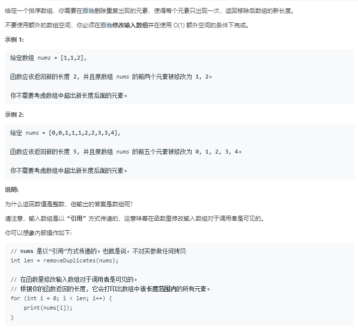

# 删除排序数组中的重复项（简单）



代码如下：

``` javascript
var removeDuplicates = function(nums) {
    var i=0;
    while(i<nums.length){
        while(nums[i]===nums[i+1]){
            nums.splice(i+1,1);
        }
        i++;
    }
    return nums.length;
};
```

运行结果：


完成日期：2019/05/14
