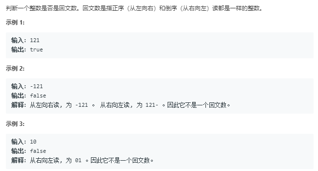

# 回文数（简单） 


代码如下：
```
var isPalindrome = function(x) {
    if(x<0){
        return false;
    }
    var arr=x.toString().split('');
    var arr2=x.toString().split('').reverse();
    return arr.toString()==arr2.toString()?true:false
};
```
运行结果：


var isPalindrome = function(x) {
    if(x<0){
        return false;
    }
    return x.toString().split('').toString()==x.toString().split('').reverse()?true:false
};
完成日期：2019/05/11