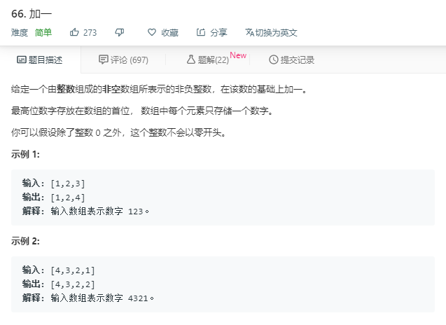
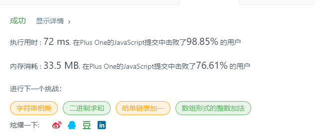

# 加一（简单）



代码如下：

``` javascript
var plusOne = function(digits) {
    for(let i=digits.length-1;i>=0;i--){
        if(digits[i]==9){
            if(i!=0){
                digits[i]=0;
            }else{
                digits[i]=0;
                digits.unshift(1)
            }
        }else{
            digits[i]++;
            break;
        }
    }
    return digits
};
```

运行结果：



完成日期：2019/05/23
