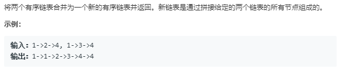
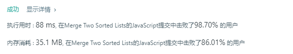

# 合并两个有序链表



代码如下：

``` javascript
var mergeTwoLists = function(l1, l2) {
    if(l1===null&&l2===null){
        return l1
    }
    var l3 = new ListNode(null);
    function pushIn(val,List){
        if(List.val===null){//是空节点则首节点赋值
            List.val=val
        }else{
            while(List.next!==null){
                List=List.next;
            }
            var a=new ListNode(val);
            List.next=a;
        }
    }
    while(l1!==null||l2!==null){
        if(l1===null&&l2!==null){
            pushIn(l2.val,l3)
            l2=l2.next
        }else if(l1!==null&&l2===null){
            pushIn(l1.val,l3)
            l1=l1.next
        }else if(l1.val<=l2.val){
            pushIn(l1.val,l3)
            l1=l1.next;
        }else{
            pushIn(l2.val,l3)
            l2=l2.next;
        }
        
    }
    return l3
}
```

运行结果：



完成日期：2019/05/14
