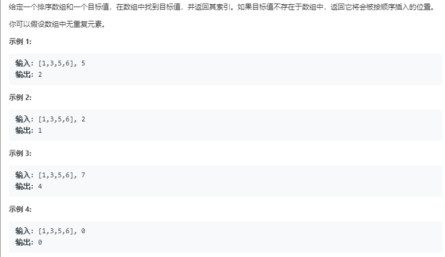

# 搜索插入位置（简单）



代码如下：

``` javascript
var searchInsert = function(nums, target) {
    for(var i=0;i<nums.length;i++){
        if(target<=nums[i]){
            return i;
        }else if(target>nums[nums.length-1]){
            return nums.length
        }
    }
};
```

运行结果：


完成日期：2019/05/17
