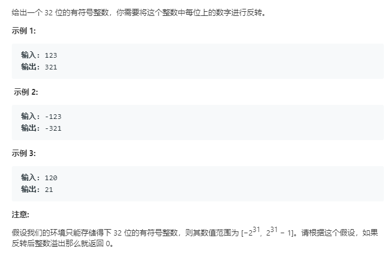
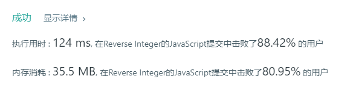

# 整数反转（简单）



代码如下：

``` javascript
var reverse = function(x) {
    var a='',
        i;
        x=x.toString();
        i=x.length;
    if(x[0]==='-'){
        a+='-'
        while(i>1){
            a+=x[i-1];
            i--;
        }
    }else{
        while(i>0){
            a+=x[i-1];
            i--;
        }
    }
    if(a <= 2147483647 && a>= -2147483648){
        return a;
    }else{
        return 0;
    }
};
```

运行结果：



完成日期：2019/05/09
