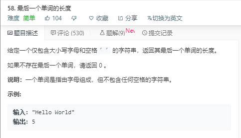
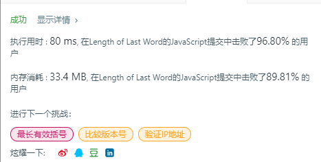

# 最后一个单词的长度（简单）



代码如下：

``` javascript
var lengthOfLastWord = function(s) {
    var length=0;
    while(s[s.length-1]==' '){
        s=s.substr(0,s.length-1)
    }
    for(var i=s.length-1;i>=0;i--){
        if(s[i]!==' '){
            length++;
        }else{
            return length;
        }
    }
    return length
};
```

运行结果：



完成日期：2019/05/20
