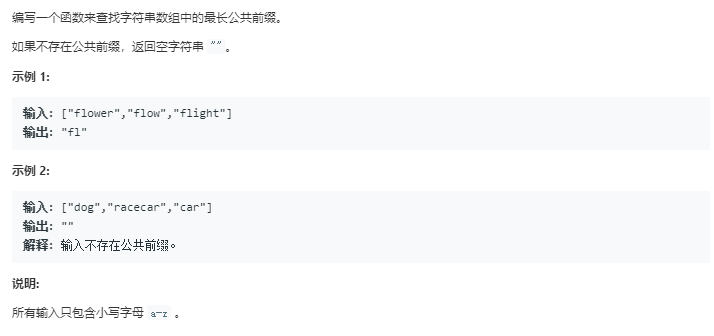

# 最长公共前缀（简单）



代码如下：

``` javascript
var longestCommonPrefix = function(strs) {
    strs.sort();
    var str='';
    var i=0;
    if(strs.length===0){
        str='';
    }else{
        while(strs[0][i]!==undefined&&strs[0][i]===strs[strs.length-1][i]){
            str+=strs[0][i]
            i++;
        }
    }
    return str;
};
```

运行结果：


完成日期：2019/05/12
