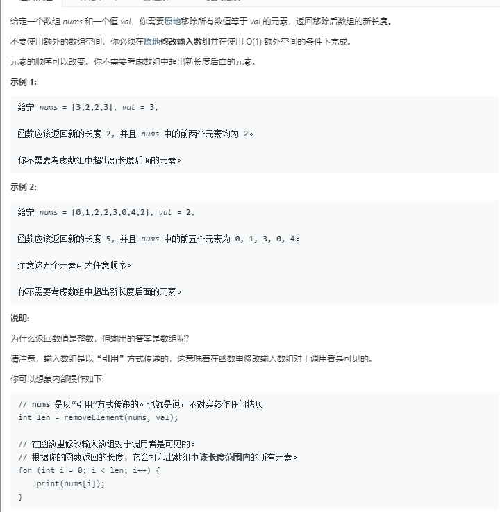
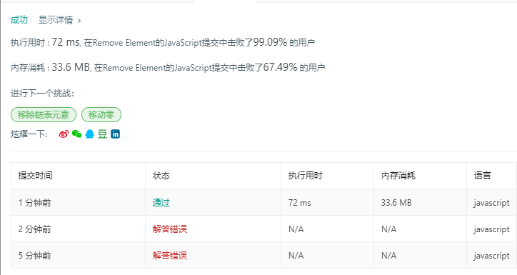

# 移除元素（简单）



代码如下：

``` javascript
var removeElement = function(nums, val) {
    var i = 0,
        length=nums.length;
    while(i<=length-1){
        while(nums[i]===val){
            nums.splice(i,1)
        }
        i++;
    }
    return nums.length;
};
```

运行结果：



完成日期：2019/05/15
